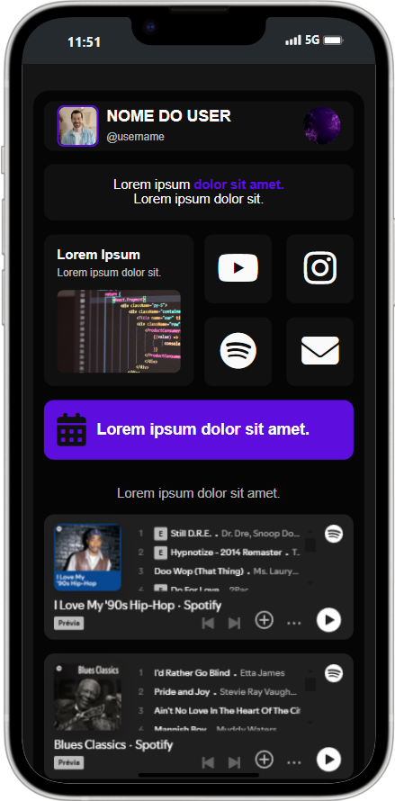

# Template-Link-Bio

Este é um template simples e estiloso para criar sua própria página de Link Bio. Ele é responsivo, leve e personalizável, perfeito para redes sociais como Instagram, TikTok e outras plataformas.

---

## 🖥️ Demonstração

Você pode visualizar o site de exemplo no seguinte link:

👉 [Visualizar site exemplo](https://links-do-ar-dev.vercel.app/)

---

## Recursos do Template

- **Design Responsivo:** Funciona em dispositivos móveis e desktops.
- **Personalização Simples:** Alterar imagens, textos e links é fácil.
- **Integração com Redes Sociais:** Inclui links prontos para Instagram, YouTube, Spotify e Email.
- **Widgets Modernos:** Inclui CTAs e embeds do Spotify.
- **Animações Suaves:** Efeitos de hover e transições agradáveis.

---

## Como Usar o Template

### 1. Clone ou Baixe o Repositório
- Clone o repositório usando o comando:
  
  ```bash
  git clone https://github.com/oalifiralph/meus-links.git
  ```
- Ou faça o download do ZIP [clicando aqui](https://github.com/oalifiralph/meus-links/archive/refs/heads/main.zip).

### 2. Edite o Conteúdo
1. Abra os arquivos no seu editor de código favorito.
2. No arquivo `index.html`, altere:
   - Nome do usuário, imagem e @username na seção principal.
   - Links para redes sociais e CTAs.
3. No arquivo `css/styles.css`, altere:
   - Paleta de cores (opcional).

### 3. Adicione suas Imagens
Substitua as imagens dentro da pasta `image`:
- `user.png`: Foto do usuário.
- `complemento.png`: Ícone complementar.
- `site.png`: Miniatura do link do site.

### 4. Publique
1. Utilize plataformas como [Netlify](https://www.netlify.com/) ou [Vercel](https://vercel.com/) para hospedar seu site gratuitamente.
2. Apenas arraste e solte os arquivos na plataforma.

---

## Estrutura do Projeto

- **index.html:** Estrutura principal da página.
- **css/styles.css:** Arquivo de estilos.
- **image:** Pasta com as imagens do projeto.

---

## Visual do Template



---

## Como Alterar os Embeds do Spotify
1. Acesse o Spotify e escolha a playlist ou música desejada.
2. Clique em **Compartilhar > Incorporar.**
3. Copie o link do embed.
4. Substitua no arquivo `index.html` na seção de iframes do Spotify.

---

## Contribuições
Contribuições são bem-vindas! Se você tem ideias para melhorar o template, envie um pull request.

---

## Licença
Este projeto está sob a licença MIT. Sinta-se à vontade para usá-lo e personalizá-lo como desejar.

---

Se você gostou deste template, é só me marcar nas redes sociais ao compartilhar! :)

---

## Conheça mais sobre mim

Me siga nas redes sociais para acompanhar meu trabalho e conteúdos:

- **LinkedIn:** [@oalifiralph](https://www.linkedin.com/in/oalifiralph/)
- **GitHub:** [@oalifiralph](https://github.com/oalifiralph/)
